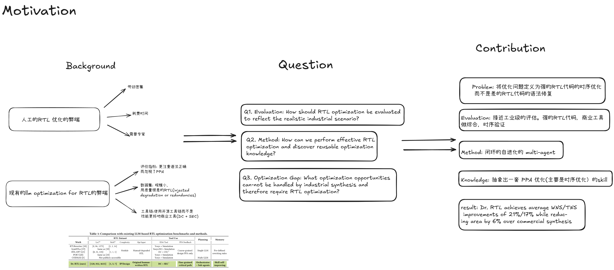

# 2026.5.6 讨论

--- 
# 目录
- 过去一段时间的总结
- 下一个阶段的规划
- paper分享 
1. stellar 复现  (上次交流的paper,vibe 复现)
1. Dr. RTL: Autonomous Agentic RTL Optimization through Tool-Grounded Self-Improvement
 
---
# 总结
## 1.cad contest找队友经历
学到了很多! 见到了很多人(有idea团队成员,2022 cad contest 冠军. 有自称是14年的华为英特尔的工程师.有华科光电的学长,现在在做创业 兆源软件).
最后团队成员. 主力开发:我和港中文师兄1. 教练:港中文师兄2
- 组队打比赛,永远是以拿奖拿第一名为目标,作为队长就是要以团队为重
- 敢于向其他人表达自己地需求, 敢于向比自己厉害的人表达自己地意见

---
# 规划

1. cad contest 备赛
2. openroad & opensta 
3. ysyx 
4. 相关paper 阅读,  VLSI Physical Design: From Graph Partitioning to Timing Closure阅读

--- 
# stellar

- 最可疑的点，原paper中的syntax correctness的正确率太高了
- 还有就是我的rag 检索的数据集 和最后测试数据集是同一套，但是 paper中的结果还是比我高了
---

# Dr. RTL: Autonomous Agentic RTL Optimization through Tool-Grounded Self-Improvement
---
## metadata

- tldr:面向工业场景的,时序驱动,以PPA作为评价指标的RTL 优化智能体
- time:2026
- author: zhiyao xie ...
- paper: arxiv
- code : not  open

---

# motivation

